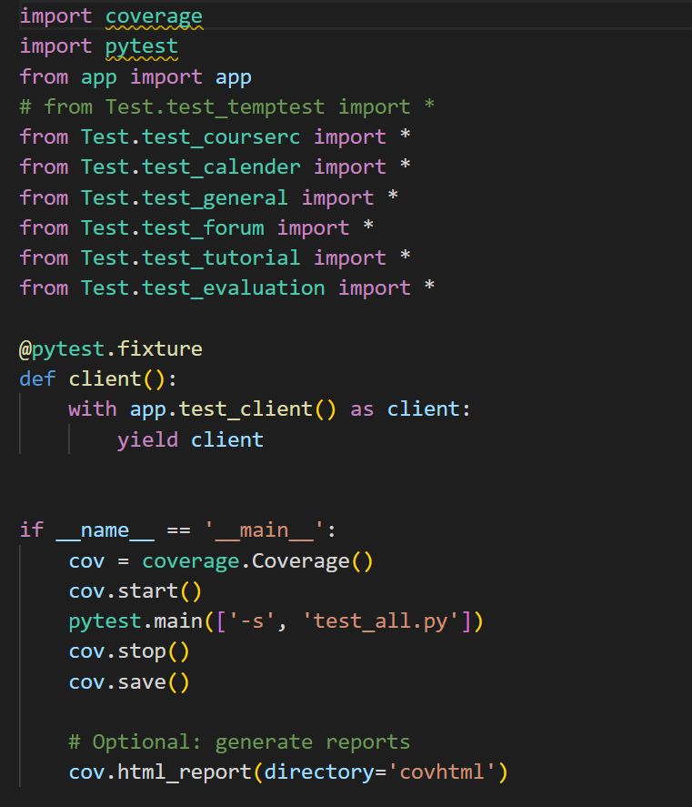
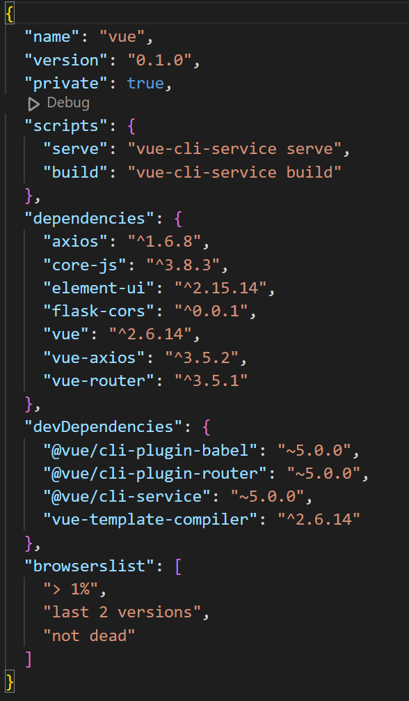
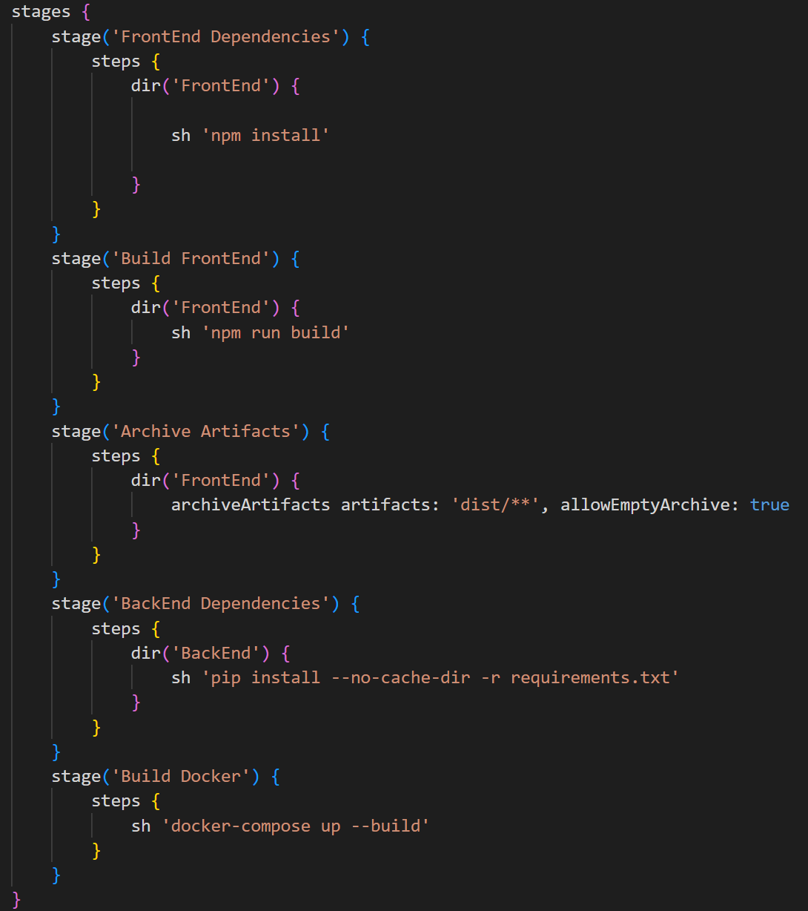

# CS304 软件工程 项目结项报告

小组成员：彭彦兮、杨浩庭、彭子燊、胡清畅

### 1. 度量指标
- ##### 代码行数，源文件数量：

###### 使用VSCodeCounter：

BackEnd 文件夹：代码共24076行，80个文件


vue 文件夹：代码共15481行，42个文件


- **包/模块数量**：

  ###### 后端：44个python文件

  ```
  BackEnd
  ├── alembic
  │   ├── env.py
  │   ├── versions
  │   │   ├── 106652dda4ee_description_of_changes.py
  │   │   ├── 387a0d1cd5c0_description_of_changes.py
  ├── alembic.ini
  ├── app.py
  ├── CourseRec
  │   ├── Class
  │   │   ├── Class_Asset.py
  │   │   ├── Class_Course.py
  │   │   ├── Class_Scheduler.py
  │   │   └── __init__.py
  │   ├── Client_buildClassTable.py
  │   ├── Client_MyWebUI.py
  │   ├── Client_pyinstaller.py
  │   ├── Client_scheduleCourse.py
  │   ├── Tool
  │   │   ├── Key_Info.py
  │   │   ├── TableEncry.py
  │   │   ├── Tool_ClientAu.py
  │   │   ├── Tool_DataBase.py
  │   │   ├── Tool_EncrytExcel.py
  │   │   ├── Tool_NewCookie.py
  │   │   ├── Tool_NewCourseInfo.py
  │   │   ├── Tool_Plan2Excel.py
  │   │   ├── Tool_RequestJson.py
  │   │   └── __init__.py
  │   ├── __init__.py
  ├── models_wholeProject.py
  ├── routes_calender.py
  ├── routes_courserc.py
  ├── routes_evaluation.py
  ├── routes_forum.py
  ├── routes_general.py
  ├── routes_temptest.py
  ├── routes_tutorial.py
  ├── Test
  │   ├── test_calender.py
  │   ├── test_courserc.py
  │   ├── test_evaluation.py
  │   ├── test_forum.py
  │   ├── test_general.py
  │   ├── test_temptest.py
  │   ├── test_tutorial.py
  ├── test_all.py
  ├── tool.py
  ├── __init__.py
  ```
  
  
  
  ###### 前端：共27个vue模块文件
  
  ```
  vue
  ├── src
  │   ├── App.vue
  │   ├── components
  │   │   ├── HelloWorld.vue
  │   │   ├── Layout.vue
  │   │   ├── Plan.vue
  │   │   └── timetable.vue
  │   └── views
  │       ├── AboutView.vue
  │       ├── FuDao
  │       │   ├── AppointmentList.vue
  │       │   ├── FuDao.vue
  │       │   └── TeacherList.vue
  │       ├── General
  │       │   ├── Login.vue
  │       │   └── Register.vue
  │       ├── GuanLi
  │       │   ├── Course.vue
  │       │   ├── GuanLi.vue
  │       │   ├── Teacher.vue
  │       │   └── Workshop.vue
  │       ├── HomeView.vue
  │       ├── LunTan
  │       │   ├── LunTan.vue
  │       │   ├── TopicDetail.vue
  │       ├── PingJiao
  │       │   ├── CourseDetail.vue
  │       │   └── PingJiao.vue
  │       ├── RiLi
  │       │   ├── Course.vue
  │       │   ├── MyCourse.vue
  │       │   └── RiLi.vue
  │       ├── test.vue
  │       ├── ValidCode.vue
  │       └── XuanKe
  │           ├── Star.vue
  │           ├── thomas.vue
  │           └── XuanKe.vue
  
  ```
  
  
  
- **依赖数量**：

  ###### 前端：package.json，共11个

  ```
  {
    "name": "vue",
    "version": "0.1.0",
    "private": true,
    "scripts": {
      "serve": "vue-cli-service serve",
      "build": "vue-cli-service build"
    },
    "dependencies": {
      "axios": "^1.6.8",
      "core-js": "^3.8.3",
      "element-ui": "^2.15.14",
      "flask-cors": "^0.0.1",
      "vue": "^2.6.14",
      "vue-axios": "^3.5.2",
      "vue-router": "^3.5.1"
    },
    "devDependencies": {
      "@vue/cli-plugin-babel": "~5.0.0",
      "@vue/cli-plugin-router": "~5.0.0",
      "@vue/cli-service": "~5.0.0",
      "vue-template-compiler": "^2.6.14"
    },
    "browserslist": [
      "> 1%",
      "last 2 versions",
      "not dead"
    ]
  }
  ```
  
  ###### 后端：requirements.txt 共15个
  
  ```
  beautifulsoup4==4.12.3
  
  coverage==7.5.3
  
  cryptography==41.0.7
  
  flasgger==0.9.7.1
  
  Flask==3.0.3
  
  Flask_Cors==4.0.0
  
  flask_sqlalchemy==3.1.1
  
  numpy==1.26.4
  
  openpyxl==3.1.2
  
  pandas==2.2.2
  
  pytest==8.1.1
  
  Requests==2.32.3
  
  selenium==4.21.0
  
  SQLAlchemy==2.0.25
  
  webdriver_manager==4.0.1
  ```
  
  ###### 

### 2. 文档
- **终端用户文档:**
  
  详见根目录README.md
  
  
  
- **开发者文档:**
  API文档快照：

  访问后端API文档：http://localhost:5050/apidocs
  

### 3. 测试
- 采用 `jest --coverage` 和 `pytest --cov` 进行自动化测试，生成测试覆盖率报告。
- 测试覆盖率报告：


- 部分测试源代码如下：


- 测试结果分析
报告的测试覆盖率为 66%，能够有效捕捉大部分关键功能异常。覆盖率无法继续提升可能因为：
1、异常处理代码没有被测试覆盖，因为测试用例没有模拟所有异常情况。
2、某些代码依赖外部系统（如数据库、第三方API等），导致测试难以进行，或者这些部分被跳过。
3、项目中存在部分遗留无用代码，这些代码可能没有测试。

### 4. 构建
- 使用 Jenkins 完成自动化构建流程。

- 构建过程中执行的任务：下载前端运行所需依赖，构建前端文件，下载后端运行所需依赖，构建容器。
- 构建完成后的产物：构建前端文件生成的index.html，可用于进一步生成可执行文件；Docker容器化整个应用的镜像。
- 与构建相关的文件：Jenkinsfile、package.json、Dockerfile。
以下是部分构建文件截图：



### 5. 部署
用于容器化和部署：
- **容器化工具**：Docker
- **构建Docker镜像**：编写 `Dockerfile`和`docker-compose.yml`，在根目录用 `docker-compose up --build` 命令进行构建。
- **成功容器化证明**：提供 `docker build` 成功的快照。


## AI使用
项目中有部分代码和架构借鉴了ChatGPT-4和copilot。所有AI提示或生成的代码都进行了适当的注释。
