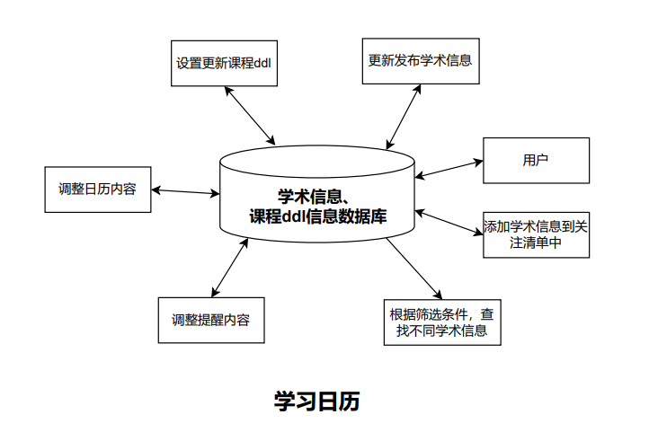
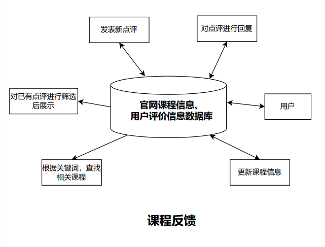

# CS304 软件工程 项目中期报告

小组成员：彭彦兮、杨浩庭、彭子燊、胡清畅

## 第一部分：架构及UI设计

#### 架构设计

##### 设计图

##### 解释说明

​	采用了数据库

#### UI设计

###### 主页面设计：

###### 个人信息页面：

###### 学习论坛主页面：

.png)

###### 学习论坛帖子详细内容：

.png)

###### 辅导咨询主页面+预约界面：

.png)

###### 辅导咨询信息填写界面：

.png)

###### 学习日历/日历设置：

.png)

###### 学习日历/学术信息活动：

.png)

###### 课程反馈/课程详细信息：

.png)

###### 课程反馈/学生点评信息：

.png)