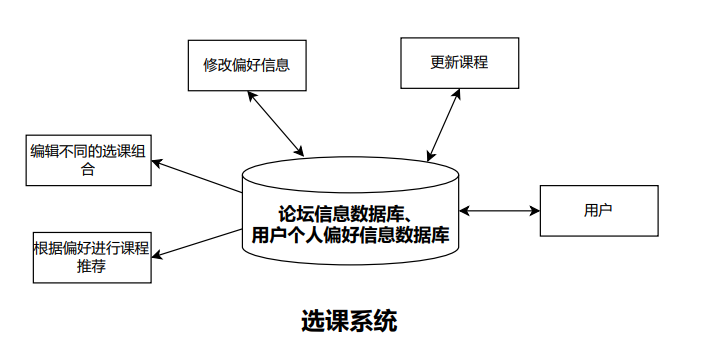

# CS304 软件工程 项目中期报告

小组成员：彭彦兮、杨浩庭、彭子燊、胡清畅

## 第一部分：架构及UI设计

#### 架构设计

##### 设计图

##### 解释说明

​	采用了Data-Centered Architecture 以数据为中心的架构，因为我们设计的功能本质上都是数据的查看和修改，都是基于数据库上的改动。其中多个数据库信息为了展示方便，将其按照五个不同的功能进行了划分。

​	中间的组件为central data，负责提供各组件和功能之间互相交换修改信息的数据存储库；周围的组件为data accessor，可以是个体（比如用户），也可以是独立组件的集合（抽象成一个功能）。

​	双向箭头表示对数据库既有存储又有读取操作，由数据库指向data accessor表示外部组件只对数据库有读取操作，而不修改数据库内容。

​	

#### UI设计

###### 主页面设计：

###### 个人信息页面：

###### 选课助手主界面：

###### 

###### 学习论坛主页面：

.png)

###### 学习论坛帖子详细内容：

.png)

###### 辅导咨询主页面+预约界面：

.png)

###### 辅导咨询信息填写界面：

.png)

###### 学习日历/日历设置：

.png)

###### 学习日历/学术信息活动：

.png)

###### 课程反馈/课程详细信息：

.png)

###### 课程反馈/学生点评信息：

.png)