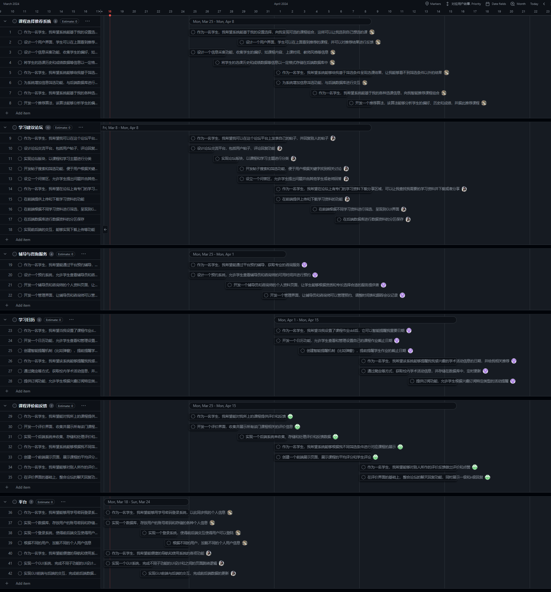

# CS304 软件工程 项目开题报告

小组成员：彭彦兮、杨浩庭、彭子燊、胡清畅

## 第一部分、项目提案

#### 项目概览

本项目旨在开发一种全新的学术辅导系统，专为南方科技大学的学生设计，特别关注新生。通过提供个性化课程推荐、学习计划建议、在线辅导与咨询服务以及学习日历管理等功能，系统致力于帮助学生高效规划和管理学术生活，从而确保他们能够拥有一个丰富且成功的大学经历。主要服务对象为南方科技大学的学生。

#### 预备需求分析

##### 功能需求

1. **课程选择推荐引擎**：
   - 该系统将采用先进的机器学习算法，根据学生的学术背景、偏好、及成绩历史，推荐最适合的课程。系统还将考虑课程时间表冲突，以帮助学生做出更明智的选择。
2. **互动学习论坛**：
   - 创建一个互动平台，让学生可以讨论课程问题、分享学习材料，并提供或获取学习建议。平台将设有专门版块用于求助帖，让学生可以在遇到困难时轻松寻求帮助。
3. **辅导与咨询服务**：
   - 学生可通过系统预约专业辅导教师或学长学姐的一对一辅导服务，支付方式灵活，可选择在线支付或使用论坛积分。针对学业压力，提供心理咨询服务，帮助学生更好地应对压力。
4. **智能学习日历**：
   - 系统提供智能学习日历，自动记录每门课程的作业截止日期，并设有提前提醒功能。学生还可以查看和订阅校内的各种学术活动，包括讲座和研讨会等。
5. **课程评价与反馈平台**：
   - 学生可对已上的课程进行评价和提供反馈，帮助其他学生在选课时做出更加明智的决定。

##### 非功能性需求

- **易用性**：界面简洁直观，确保用户能够快速上手操作。
- **安全性**：加密用户数据，保护用户隐私，遵守数据保护法规。
- **性能**：响应时间小于2秒，确保用户在高并发情况下也能获得流畅体验。
- **可靠性**：系统运行稳定，周平均故障时间不超过1小时。

##### 数据需求

- **学生数据**：利用学校现有的学生信息系统接口，导入学生的成绩、选课历史等数据。
- **课程数据**：与教务系统对接，获取课程描述、教师信息、时间表等数据。
- **学术活动数据**：从校园网站和相关部门收集活动信息，定期更新。

##### 技术需求

- **操作环境**：确保系统兼容主流的Web浏览器。
- **技术栈选择**：前端开发采用React框架提高用户界面的交互性和动态性，后端开发采用Node.js搭配Express框架以支持高并发处理，数据库选择PostgreSQL以提供强大的数据处理能力。

### 总结

该项目提案旨在通过开发一个综合性的学术辅导系统，帮助南方科技大学的学生更好地规划和管理自己的学术生涯。通过引入最新的技术和研究成果，结合实际学习场景的需求分析，我们相信这个系统将极大地改善学生的学习体验和成效。

## 第二部分、任务分解与规划

 

## 第三部分、AI使用

在完成上述两部分的过程中，我们小组使用了AI工具进行辅助

1. 在提出项目特性方面，我们利用AI生成了一些可能的特性。然后，我们根据实际需求和项目目标对这些特性进行了调整和修改，以确保最终的特性符合项目的实际需求和用户期望。
2. 在需求分析方面，我们使用AI工具进行了初步需求分析，确定了可能存在的项目的功能需求和非功能性需求。然后，我们对完成各项需求的预算和时间进行了评估和规划，确定了这些需求的优先级和实现可行性，并根据实际情况对这些需求进行了调整和优化。
3. 在生成用户故事方面，我们用AI工具生成了一些用户故事，描述了用户在使用系统时可能遇到的场景和需求。然后，我们根据实际情况对这些用户故事进行了细化和修改，以确保最终的用户故事能够真实反映用户需求和使用场景。
4. 在生成问题和任务方面，我们利用AI生成了一些需要解决的问题。在考虑了项目的技术可行性和限制，以及可能面临的技术挑战和难题后，我们对这些问题进行了深入分析和讨论，以找到最佳的解决方案。

总体而言，我们在使用AI工具过程中得到了很多启发和指导，但在给出最终答案时，我们结合了实际情况进行了修改和调整，以确保最终的解决方案符合项目的实际需求和要求。
